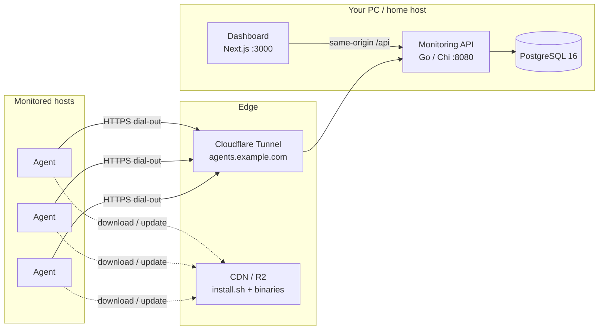

# FleetDeck

**Local-first infrastructure command center** for self-hosted monitoring and Docker management.

FleetDeck runs on your machine (or a small home box). Lightweight Go agents on each host dial out with real metrics and Docker inventory — no inbound management ports, no Docker socket in the browser, no fake production data.

| | |
|---|---|
| **Status** | `0.4.2-dev` — core stack shipped; see [DEFINITION_OF_DONE.md](docs/DEFINITION_OF_DONE.md) for remaining production gates |
| **Dashboard** | http://localhost:3000 |
| **API** | http://localhost:8080/healthz |
| **Remote agents** | Cloudflare Tunnel + CDN (R2) — [REMOTE_AGENTS.md](docs/REMOTE_AGENTS.md) |

---

## Screenshots

Live UI captures with **anonymized demo host names** (no real org/domains, IPs, tokens, or enroll one-liners).

### Dashboard

Fleet-wide health score, online counts, and a live server card grid (CPU / RAM / disk, network, uptime).


### Servers

Enrollment flow, agent versions, **Update agent** / **Remove** from the panel.


### Docker

Aggregated container / image / volume / network inventory from enrolled agents.


### Alerts

Rules evaluate real metrics and inventory — acknowledge, silence, resolve.


---

## What it does

- **Monitor hosts** — CPU, memory, disk, network, load, uptime, host identity
- **Manage Docker remotely** — inventory, container stats, logs, start/stop/restart/pause (confirmed + audited)
- **Alert on real conditions** — unhealthy containers, resource pressure, offline agents
- **Operate a fleet from one panel** — enroll, update, and uninstall agents without SSHing for routine work
- **Stay local-first** — Compose stack on your PC; remote VPS agents reach you through Cloudflare Tunnel

---

## Architecture



**Security model in one line:** agents dial out; the Docker Engine API stays on the host; the dashboard never sees the socket or agent secrets.

---

## Features

| Area | Capabilities |
|------|----------------|
| **Auth** | First-run admin bootstrap, Argon2id passwords, session cookies, CSRF, roles (admin / operator / viewer) |
| **Metrics** | Real host metrics, retention + rollups, freshness labels, realtime WebSocket updates |
| **Servers** | Enrollment tokens, online/offline, compare, topology, search (`Ctrl+K`) |
| **Docker** | Containers, compose, images, volumes, networks; logs; confirmed management actions |
| **Alerts** | Rule engine on live metrics/inventory; acknowledge / silence / resolve |
| **Notifications** | In-app alerts center |
| **Agents** | Dial-out Go agent; panel **Update** and **Remove** (uninstall path units); CDN install / upgrade |
| **Ops** | CSV/JSON export, backup/restore, self-metrics, dark/light theme |
| **Deploy** | Docker Compose for web + API + Postgres; optional Cloudflare Tunnel profile |

---

## Quick start

### 1. Environment

```bash
cp .env.example .env
# Set SESSION_SECRET to a long random value before any shared use:
#   openssl rand -base64 48
```

Key variables (see `.env.example`):

| Variable | Purpose |
|----------|---------|
| `DATABASE_URL` | Postgres connection string |
| `SESSION_SECRET` | ≥ 32 chars — derives envelope key for `secrets` table (sessions are opaque + DB-hashed) |
| `WEB_ORIGIN` | Dashboard origins for CORS/cookies |
| `API_PUBLIC_URL` | URL agents use after enroll (tunnel hostname for remote) |
| `AGENT_CDN_BASE` / `AGENT_CDN_CHANNEL` | Where panel updates pull binaries |
| `COOKIE_SECURE` | `false` on plain `http://localhost`; `true` behind HTTPS |

### 2. Full stack (Compose)

```bash
docker compose -f deploy/docker-compose.yml up -d --build
```

| Service | Port | Notes |
|---------|------|-------|
| `web` | **3000** | Dashboard |
| `api` | **8080** | Monitoring API + agent ingest |
| `db` | **5433→5432** | PostgreSQL 16 (host 5433 avoids local Postgres clashes) |

Day-to-day on Windows (honors tunnel token if set):

```powershell
.\scripts\start.ps1 -Build
```

**Autostart on Windows logon:** enable Docker Desktop “Start Docker Desktop when you log in”, then:

```powershell
.\scripts\install-autostart.ps1   # Scheduled Task FleetDeck-Autostart
# .\scripts\uninstall-autostart.ps1
```

Details: [DEPLOYMENT.md](docs/DEPLOYMENT.md#windows-autostart-logon).

### 3. First login (local)

On a fresh database the UI prompts **Create admin account** (bootstrap).

If you already bootstrapped during development, sign in with that admin. There is **no default password in images** — change any shared/dev passwords before exposing the stack.

### 4. Cloudflare Tunnel (remote agents)

FleetDeck stays on your PC. Agents reach the API through a tunnel:

```powershell
$env:CLOUDFLARE_API_TOKEN = "your-api-token"   # Tunnel Edit + DNS Edit
.\scripts\setup-cloudflare-tunnel.ps1
```

That creates/reuses tunnel `fleetdeck-home`, points DNS at the API, writes `CLOUDFLARE_TUNNEL_TOKEN` + `API_PUBLIC_URL` into `.env`, and starts Compose with the tunnel profile.

Verify:

```powershell
curl.exe -sS https://agents.tarkovbot.com/healthz
```

(Your hostname may differ — use the `API_PUBLIC_URL` from `.env`.)

### 5. Publish agent binaries to CDN (R2)

Set `R2_ACCOUNT_ID`, `R2_ACCESS_KEY_ID`, `R2_SECRET_ACCESS_KEY`, `R2_BUCKET` in `.env`, then:

```powershell
.\scripts\publish-cdn.ps1 -Version 0.4.2-dev
# Skip upload:  .\scripts\publish-cdn.ps1 -NoUpload
# Force upload: .\scripts\publish-cdn.ps1 -Upload
```

Artifacts land under the public CDN prefix (`install.sh`, `upgrade.sh`, `latest/linux-amd64`, `latest/linux-arm64`, …).

---

## Remote agent install & upgrade

### Install (one-liner)

Dashboard → **Servers → Add server** → copy the enrollment command:

```bash
curl -fsSL https://cdn.tarkovbot.com/fleetdeck/install.sh | sudo bash -s -- --token 'TOKEN'
```

Your PC must stay online (Compose + `cloudflared`). Binaries come from CDN; the agent dials `API_PUBLIC_URL` through the tunnel.

### Update from the panel

**Servers** → **Update agent** (online agent, **0.4.2-dev+** with update path units):

1. API queues `agent.update` with `cdn_base` + `channel`
2. Agent downloads `linux-{amd64|arm64}`, verifies `SHA256SUMS` when present
3. Privileged oneshot replaces `/usr/local/bin/fleetdeck-agent` and restarts — **credentials under `/var/lib/fleetdeck` are not touched**

### Manual CDN upgrade (older agents)

Hosts still on **0.4.0** (no `agent.update`):

```bash
curl -fsSL https://cdn.tarkovbot.com/fleetdeck/upgrade.sh | sudo bash
```

Keeps credentials and installs missing update/uninstall path units.

### Uninstall

- **Panel Remove** (online): queues `agent.uninstall`, then deletes DB rows
- **Offline**: Force remove from panel (DB only) + host cleanup:

```bash
sudo fleetdeck-agent -uninstall
```

Details: [docs/AGENT.md](docs/AGENT.md), [docs/REMOTE_AGENTS.md](docs/REMOTE_AGENTS.md).

---

## Development (split processes)

```bash
cp .env.example .env
docker compose -f deploy/docker-compose.yml up -d db

cd apps/api && go run ./cmd/fleetdeck-api
cd apps/web && pnpm dev

# After UI enrollment token:
cd apps/agent && go run ./cmd/fleetdeck-agent -api http://localhost:8080 -token <token>
```

Prerequisites: Go 1.26+, Node 24+ / pnpm 10+, Docker. See [docs/DEVELOPMENT.md](docs/DEVELOPMENT.md).

---

## Project structure

```text
fleetdeck/
├── apps/
│   ├── api/          # Go monitoring API (Chi, Postgres, workers)
│   ├── agent/        # Go host agent (metrics, Docker, commands)
│   └── web/          # Next.js dashboard
├── deploy/           # Compose, Dockerfiles, systemd units
├── docs/             # Architecture, security, ops guides + screenshots/
├── scripts/          # start, tunnel setup, CDN publish, installers
├── cdn/              # CDN packaging helpers
└── .env.example      # Template — never commit real .env
```

---

## Security notes

- **No default admin password** in images; bootstrap creates the first account interactively.
- Treat agent `credentials.json` like host root access (`chmod 600`).
- One enrollment token binds one server — do not reuse across hosts.
- Do **not** mount the Docker socket into FleetDeck API/web containers.
- Dashboard must never receive decryptable agent secrets or DB passwords.
- Set a strong `SESSION_SECRET`; enable `COOKIE_SECURE=true` (and TLS) before any public exposure.
- Never commit `.env`, `.env.relay`, PEM/keys, or credential files (see `.gitignore`).

More: [docs/SECURITY.md](docs/SECURITY.md), [docs/SECURITY_REVIEW.md](docs/SECURITY_REVIEW.md).

---

## Documentation

| Doc | Topic |
|-----|--------|
| [ARCHITECTURE.md](docs/ARCHITECTURE.md) | Components, data flow, stack choices |
| [AGENT.md](docs/AGENT.md) | Agent role, update/uninstall, flags, CDN |
| [REMOTE_AGENTS.md](docs/REMOTE_AGENTS.md) | Tunnel + R2 + VPS enroll/upgrade |
| [DEPLOYMENT.md](docs/DEPLOYMENT.md) | Compose, env, TLS, backup |
| [DEVELOPMENT.md](docs/DEVELOPMENT.md) | Local split-process workflow |
| [API.md](docs/API.md) | HTTP API surface |
| [DATA_MODEL.md](docs/DATA_MODEL.md) | Schema / entities |
| [UI.md](docs/UI.md) | Dashboard IA and UX principles |
| [SECURITY.md](docs/SECURITY.md) | Threat model and controls |
| [SECURITY_REVIEW.md](docs/SECURITY_REVIEW.md) | Hardening residuals |
| [RELEASE.md](docs/RELEASE.md) | Packaging and release |
| [RELEASE_NOTES.md](docs/RELEASE_NOTES.md) | Changelog (0.4.x-dev) |
| [TROUBLESHOOTING.md](docs/TROUBLESHOOTING.md) | Common failures |
| [DEFINITION_OF_DONE.md](docs/DEFINITION_OF_DONE.md) | Production readiness checklist |
| [AUDIT.md](docs/AUDIT.md) | Audit log notes |

---

## Stack

| Layer | Tech |
|-------|------|
| API | Go, Chi, PostgreSQL 16 |
| Web | Next.js, React, Tailwind, ECharts |
| Agent | Go (static Linux amd64/arm64) |
| Deploy | Docker Compose · Cloudflare Tunnel · R2 CDN |

---

## License / status

Private project — **0.4.2-dev** pre-1.0. Core monitoring, Docker ops, alerts, and remote agent lifecycle are implemented; signed releases and fuller CI remain on the roadmap.
