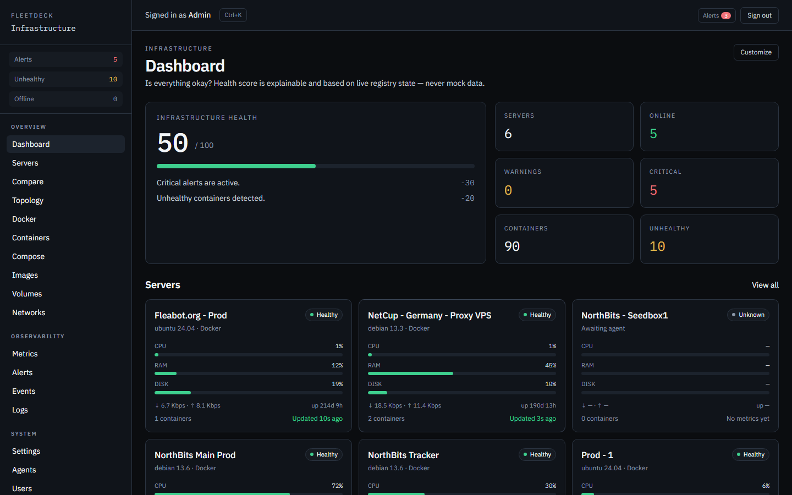
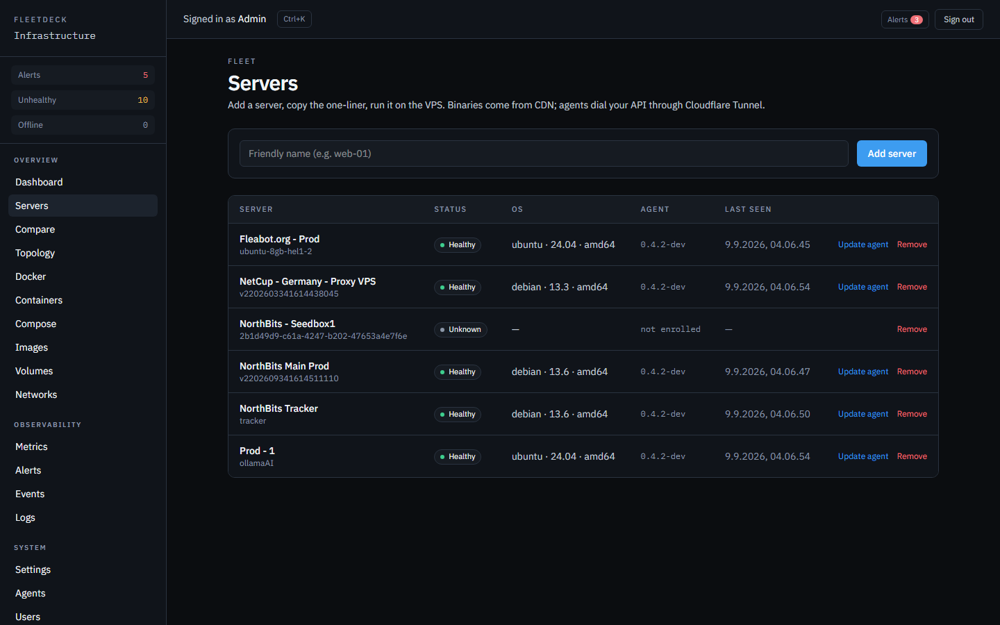
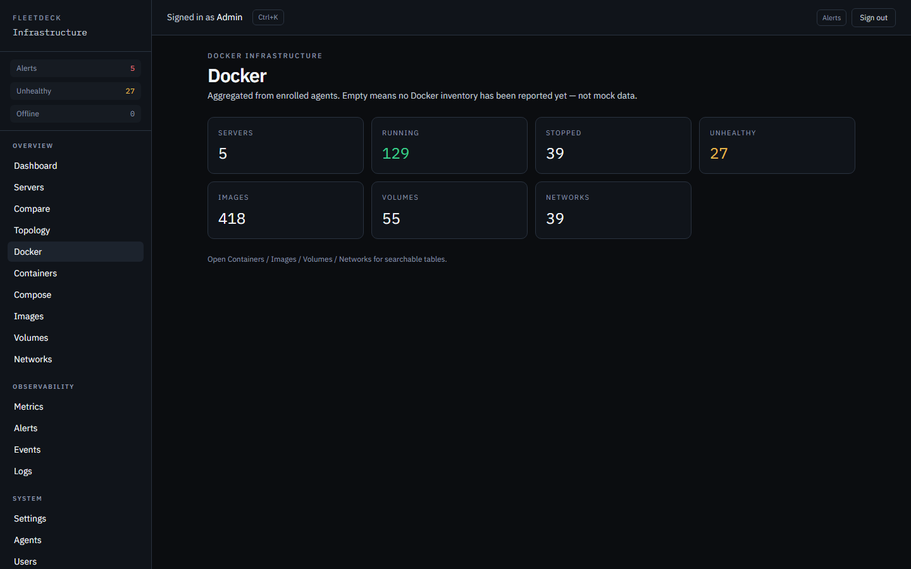
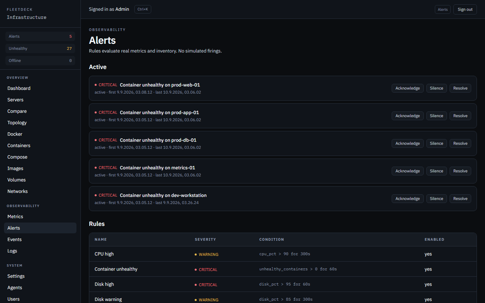
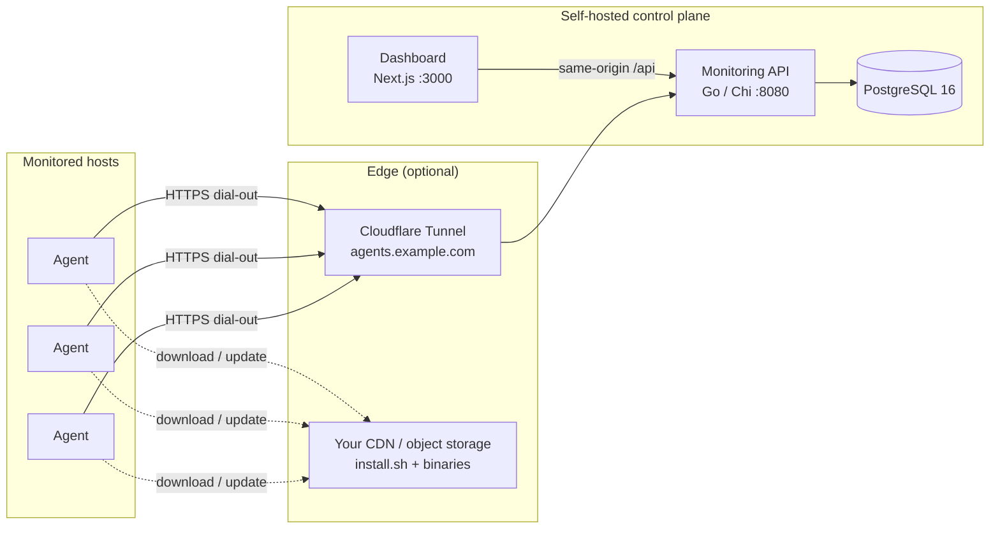

# FleetDeck

**Self-hosted infrastructure command center** — monitor hosts, manage Docker, and run alerts from one panel.

Lightweight Go agents dial out with real metrics and Docker inventory. No inbound management ports on hosts, no Docker socket in the browser, no fake production data.

[](https://github.com/fleames/fleetdeck/actions/workflows/ci.yml)
[](LICENSE)
[](https://go.dev/)
[](https://nextjs.org/)

| | |
|---|---|
| **Status** | `0.4.3-dev` — core stack shipped; see [DEFINITION_OF_DONE.md](docs/DEFINITION_OF_DONE.md) |
| **Dashboard** | http://localhost:3000 |
| **API** | http://localhost:8080/healthz |
| **Docs** | [docs/README.md](docs/README.md) |

---

## Screenshots

Anonymized demo captures (no real org names, IPs, tokens, or enroll one-liners).

### Dashboard

Fleet-wide health score, online counts, and a live server card grid (CPU / RAM / disk, network, uptime).



### Servers

Enrollment flow, agent versions, **Update agent** / **Remove** from the panel.



### Docker

Aggregated container / image / volume / network inventory from enrolled agents.



### Alerts

Rules evaluate real metrics and inventory — acknowledge, silence, resolve.



---

## Why FleetDeck

- **Monitor hosts** — CPU, memory, disk, network, load, uptime, host identity
- **Manage Docker remotely** — inventory, container stats, logs, start/stop/restart/pause (confirmed + audited)
- **Alert on real conditions** — unhealthy containers, resource pressure, offline agents
- **Operate a fleet from one panel** — enroll, update, and uninstall agents without SSHing for routine work
- **Stay self-hosted** — Docker Compose on your box; remote agents reach you through a tunnel you control

---

## Architecture



**Security model in one line:** agents dial out; the Docker Engine API stays on the host; the dashboard never sees the socket or agent secrets.

---

## Features

| Area | Capabilities |
|------|----------------|
| **Auth** | First-run admin bootstrap, Argon2id passwords, session cookies, CSRF, roles (admin / operator / viewer) |
| **Metrics** | Real host metrics, retention + rollups, freshness labels, realtime WebSocket updates |
| **Servers** | Enrollment tokens, online/offline, compare, topology, search (`Ctrl+K`) |
| **Docker** | Containers, compose, images, volumes, networks; logs; confirmed management actions |
| **Alerts** | Rule engine on live metrics/inventory; acknowledge / silence / resolve |
| **Agents** | Dial-out Go agent; panel **Update** and **Remove**; CDN install / upgrade |
| **Ops** | CSV/JSON export, backup/restore, self-metrics, dark/light theme |
| **Deploy** | Docker Compose for web + API + Postgres; optional Cloudflare Tunnel profile |

---

## Quick start

### 1. Clone and configure

```bash
git clone https://github.com/fleames/fleetdeck.git
cd fleetdeck
cp .env.example .env
# Set SESSION_SECRET before any shared use:
#   openssl rand -base64 48
```

Key variables (see [`.env.example`](.env.example)):

| Variable | Purpose |
|----------|---------|
| `DATABASE_URL` | Postgres connection string |
| `SESSION_SECRET` | ≥ 32 chars — derives envelope key for `secrets` table |
| `WEB_ORIGIN` | Dashboard origins for CORS/cookies |
| `API_PUBLIC_URL` | URL agents use after enroll (localhost locally; tunnel hostname for remote) |
| `AGENT_CDN_BASE` / `AGENT_CDN_CHANNEL` | Where panel updates pull binaries (your CDN) |
| `COOKIE_SECURE` | `false` on plain `http://localhost`; `true` behind HTTPS |

### 2. Start the stack

```bash
docker compose -f deploy/docker-compose.yml up -d --build
```

| Service | Port | Notes |
|---------|------|-------|
| `web` | **3000** | Dashboard |
| `api` | **8080** | Monitoring API + agent ingest |
| `db` | **5433→5432** | PostgreSQL 16 (host 5433 avoids local Postgres clashes) |

Open **http://localhost:3000** and create the first admin account (bootstrap). There is **no default password** in images.

Windows helper (optional):

```powershell
.\scripts\start.ps1 -Build
```

### 3. Enroll a local agent (optional)

After creating an enrollment token in **Servers → Add server**:

```bash
cd apps/agent
go run ./cmd/fleetdeck-agent -api http://localhost:8080 -token <token>
```

Or install a Linux binary from your CDN / release artifacts — see [docs/AGENT.md](docs/AGENT.md).

---

## Remote agents (tunnel + CDN)

For hosts that are not on your LAN, expose the API with a tunnel and host agent binaries on object storage you control.

**Pattern:**

1. Run FleetDeck via Compose on your control-plane host.
2. Put a **Cloudflare Tunnel** (or reverse proxy) in front of the API → set `API_PUBLIC_URL=https://agents.example.com`.
3. Publish `install.sh`, `upgrade.sh`, and `linux-{amd64,arm64}` to a public CDN prefix → set `AGENT_CDN_BASE`.
4. Enroll from the dashboard one-liner (uses your CDN base).

Automated helpers (Windows-oriented; requires your Cloudflare credentials in `.env`):

```powershell
$env:CLOUDFLARE_API_TOKEN = "your-api-token"   # Tunnel Edit + DNS Edit
.\scripts\setup-cloudflare-tunnel.ps1 -Hostname agents.example.com
.\scripts\publish-cdn.ps1 -Version 0.4.3-dev
```

Verify:

```bash
curl -fsS https://agents.example.com/healthz
```

Install on a remote host (replace CDN URL and token):

```bash
curl -fsSL https://cdn.example.com/fleetdeck/install.sh | sudo bash -s -- --token 'TOKEN'
```

Scripts under `cdn/fleetdeck/` and `scripts/` may ship with **optional maintainer CDN defaults** for convenience — override with `FLEETDECK_CDN`, `AGENT_CDN_BASE`, and `API_PUBLIC_URL` for your own domains. Details: [REMOTE_AGENTS.md](docs/REMOTE_AGENTS.md).

---

## Development (split processes)

```bash
cp .env.example .env
docker compose -f deploy/docker-compose.yml up -d db

cd apps/api && go run ./cmd/fleetdeck-api
cd apps/web && pnpm install && pnpm dev

# After UI enrollment token:
cd apps/agent && go run ./cmd/fleetdeck-agent -api http://localhost:8080 -token <token>
```

Prerequisites: Go 1.26+ (API) / 1.25+ (agent), Node 24+ / pnpm 10+, Docker. See [docs/DEVELOPMENT.md](docs/DEVELOPMENT.md).

---

## Project structure

```text
fleetdeck/
├── apps/
│   ├── api/          # Go monitoring API (Chi, Postgres, workers)
│   ├── agent/        # Go host agent (metrics, Docker, commands)
│   └── web/          # Next.js dashboard
├── deploy/           # Compose, Dockerfiles, systemd units
├── docs/             # Guides + screenshots/
├── scripts/          # start, tunnel setup, CDN publish, installers
├── cdn/              # CDN packaging helpers
└── .env.example      # Template — never commit real .env
```

---

## Security notes

- **No default admin password** in images; bootstrap creates the first account interactively.
- Treat agent `credentials.json` like host root access (`chmod 600`).
- One enrollment token binds one server — do not reuse across hosts.
- Do **not** mount the Docker socket into FleetDeck API/web containers.
- Set a strong `SESSION_SECRET`; enable `COOKIE_SECURE=true` (and TLS) before any public exposure.
- Never commit `.env`, PEM/keys, or credential files (see `.gitignore`).

Threat model: [docs/SECURITY.md](docs/SECURITY.md). To report a vulnerability: [SECURITY.md](SECURITY.md).

---

## Documentation

Full index: **[docs/README.md](docs/README.md)**

| Doc | Topic |
|-----|--------|
| [ARCHITECTURE.md](docs/ARCHITECTURE.md) | Components, data flow, stack choices |
| [AGENT.md](docs/AGENT.md) | Agent role, update/uninstall, flags, CDN |
| [REMOTE_AGENTS.md](docs/REMOTE_AGENTS.md) | Tunnel + CDN + remote enroll/upgrade |
| [DEPLOYMENT.md](docs/DEPLOYMENT.md) | Compose, env, TLS, backup |
| [DEVELOPMENT.md](docs/DEVELOPMENT.md) | Local split-process workflow |
| [TROUBLESHOOTING.md](docs/TROUBLESHOOTING.md) | Common failures |
| [RELEASE_NOTES.md](docs/RELEASE_NOTES.md) | Changelog (`0.4.x-dev`) |

---

## Contributing

Contributions are welcome. See [CONTRIBUTING.md](CONTRIBUTING.md) and the [Code of Conduct](CODE_OF_CONDUCT.md).

## License

[MIT](LICENSE) © fleames

**Status:** pre-1.0 (`0.4.3-dev`). Core monitoring, Docker ops, alerts, and remote agent lifecycle are implemented; signed releases and broader packaging remain on the roadmap.
